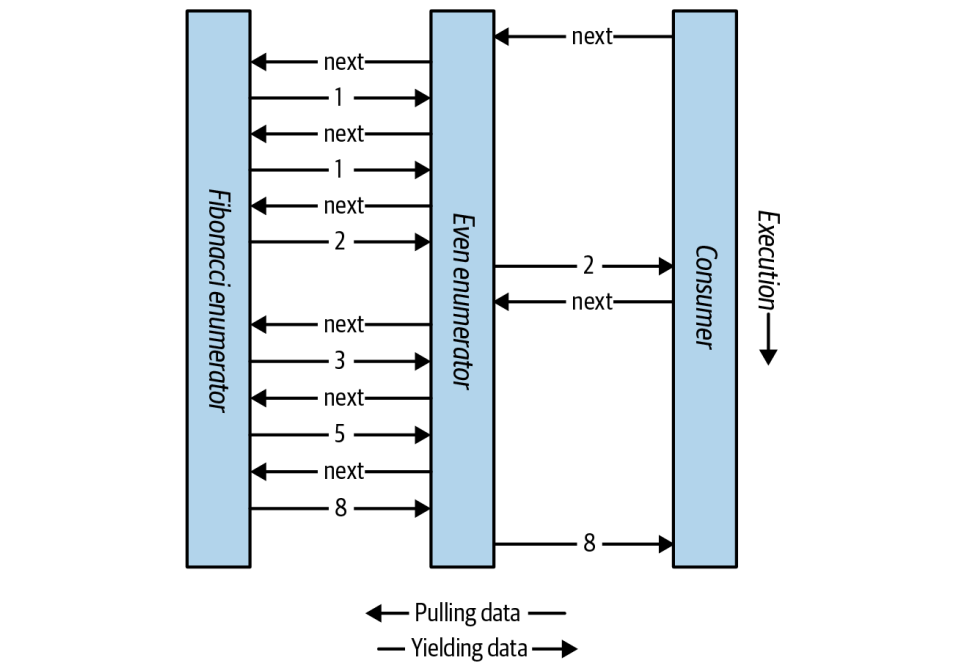

## Enumeration
An enumerator is a read-only, forward-only cursor over a sequence of values. C#
treats a type as an enumerator if it does any of the following:
- Has a public parameterless method named MoveNext and property called Current
- Implements System.Collections.Generic.IEnumerator<T>
- Implements System.Collections.IEnumerator

The foreach statement iterates over an enumerable object. An enumerable object is
the logical representation of a sequence. It is not itself a cursor but an object that
produces cursors over itself. C# treats a type as enumerable if it does any of the
following (the check is performed in this order):
- Has a public parameterless method named GetEnumerator that returns an
enumerator
- Implements System.Collections.Generic.IEnumerable<T>
- Implements System.Collections.IEnumerable
- (From C# 9) Can bind to an extension method named GetEnumerator that returns an enumerator

Here is the high-level way of iterating through the characters in the word “beer” using a foreach statement: 
```csharp
foreach (char c in "beer")
Console.WriteLine (c);
```
Here is the low-level way of iterating through the characters in “beer” without using a foreach statement:
```csharp
using (var enumerator = "beer".GetEnumerator())
while (enumerator.MoveNext())
{
    var element = enumerator.Current;
    Console.WriteLine (element);
}
```
##### NOTE: If the enumerator implements IDisposable, the foreach statement also acts as a using statement, implicitly disposing the enumerator object.

### Iterators

Whereas a foreach statement is a consumer of an enumerator, an iterator is a
producer of an enumerator. In this example, we use an iterator to return a sequence
of Fibonacci numbers (where each number is the sum of the previous two)

```csharp
using System;
using System.Collections.Generic;
foreach (int fib in Fibs(6))
 Console.Write (fib + " ");
}
IEnumerable<int> Fibs (int fibCount)
{
 for (int i = 0, prevFib = 1, curFib = 1; i < fibCount; i++)
 {
 yield return prevFib;
 int newFib = prevFib+curFib;
 prevFib = curFib;
 curFib = newFib;
 }
}
```
Whereas a return statement expresses, “Here’s the value you asked me to return
from this method,” a yield return statement expresses, “Here’s the next element
you asked me to yield from this enumerator.” On each yield statement, control is
returned to the caller, but the callee’s state is maintained so that the method can
continue executing as soon as the caller enumerates the next element. The lifetime
of this state is bound to the enumerator such that the state can be released when the
caller has finished enumerating.


Multiple yield statements are permitted:
```csharp
foreach (string s in Foo())
Console.WriteLine(s); // Prints "One","Two","Three"
IEnumerable<string> Foo()
{
    yield return "One";
    yield return "Two";
    yield return "Three";
}
```

A return statement is illegal in an iterator block; instead you must use the yield
break statement to indicate that the iterator block should exit early, without returning more elements. We can modify Foo as follows to demonstrate:

```csharp
IEnumerable<string> Foo (bool breakEarly)
{
     yield return "One";
     yield return "Two";
     if (breakEarly)
     yield break;
     yield return "Three";
}
```

#### Composing Sequences
Iterators are highly composable. We can extend our example, this time to output even Fibonacci numbers only:
```csharp
    public void Execute()
    {
        foreach (int fib in EvenNumbersOnly (Fibs(6)))
            Console.WriteLine (fib);
    }
    
    IEnumerable<int> Fibs(int fibCount)
    {
        for (int i = 0, prevFib = 1, curFib = 1; i < fibCount; i++)
        {
            yield return prevFib;
            int newFib = prevFib + curFib;
            prevFib = curFib;
            curFib = newFib;
        }
    }

    IEnumerable<int> EvenNumbersOnly(IEnumerable<int> sequence)
    {
        foreach (int x in sequence)
            if ((x % 2) == 0)
                yield return x;
    }
```


